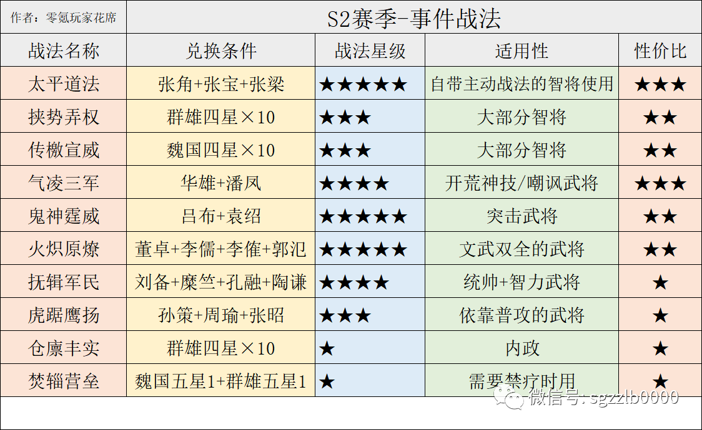
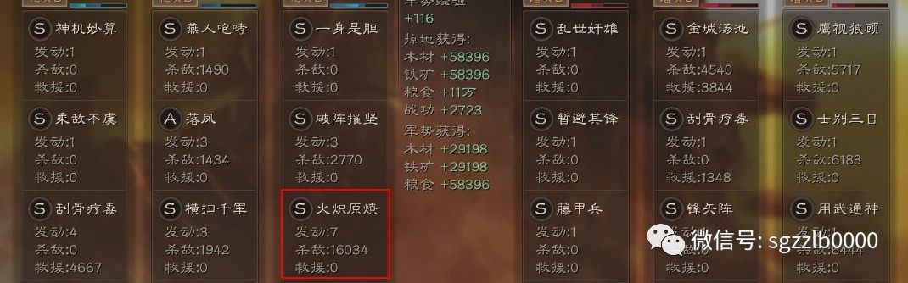
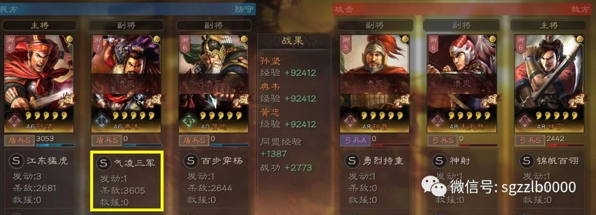
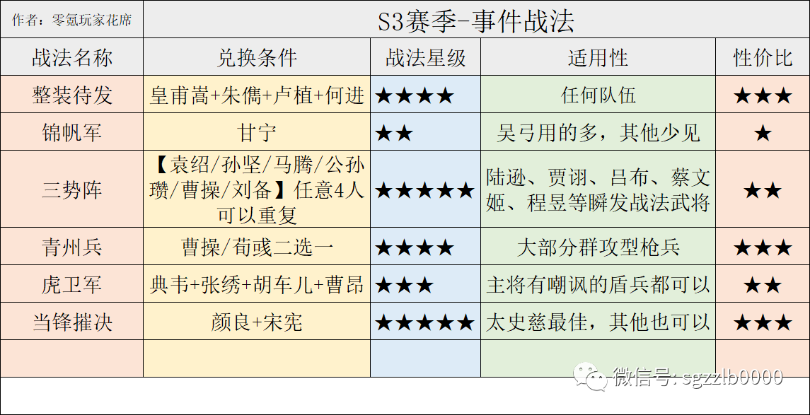
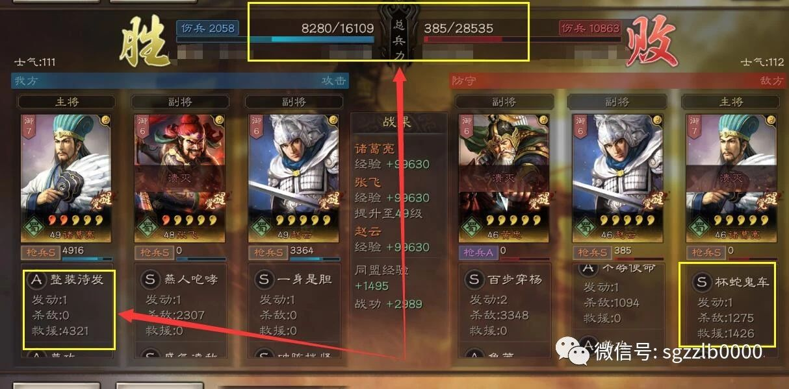
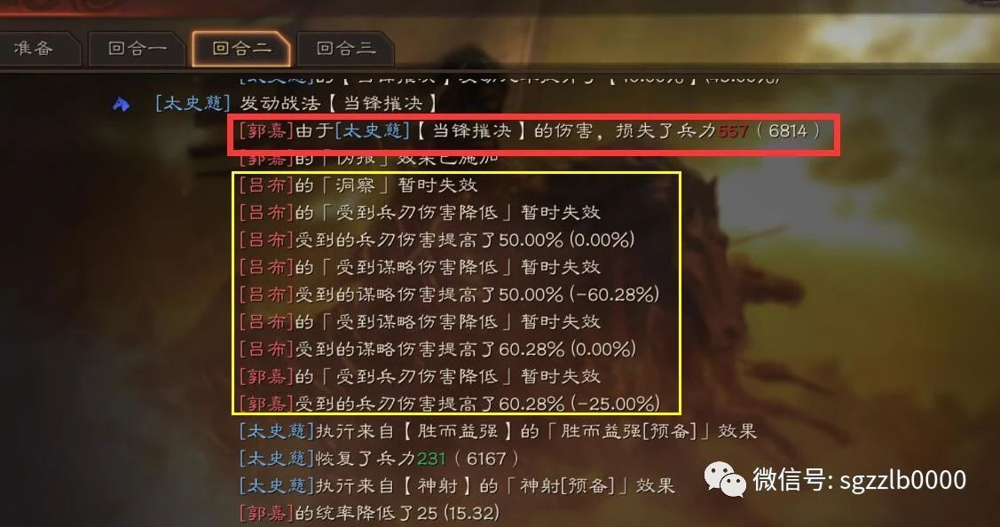
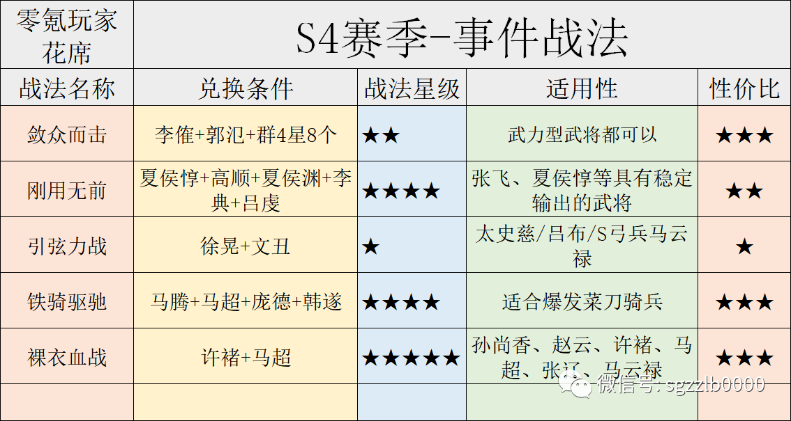
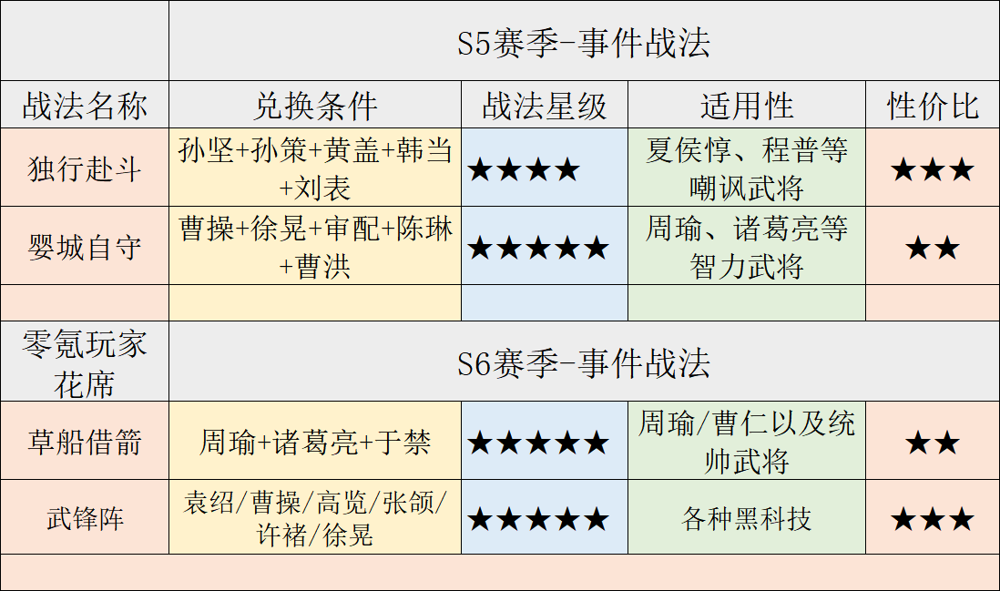
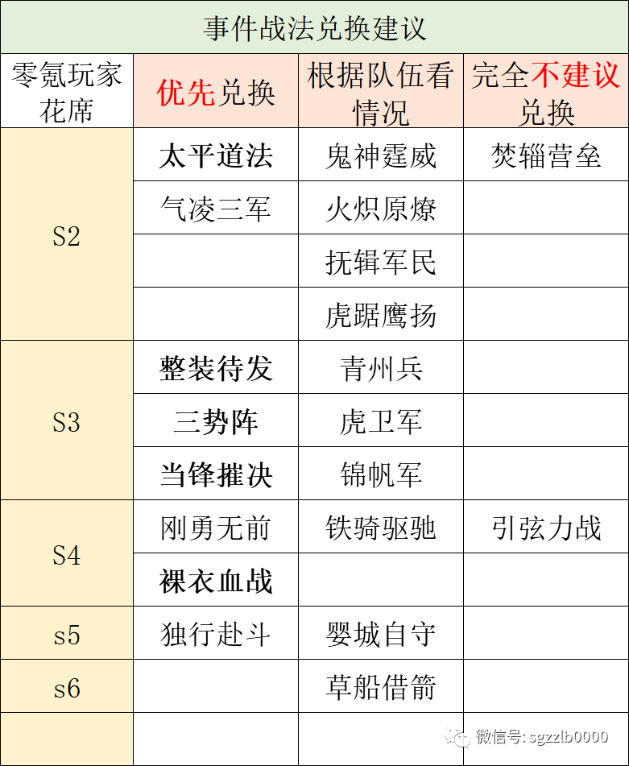
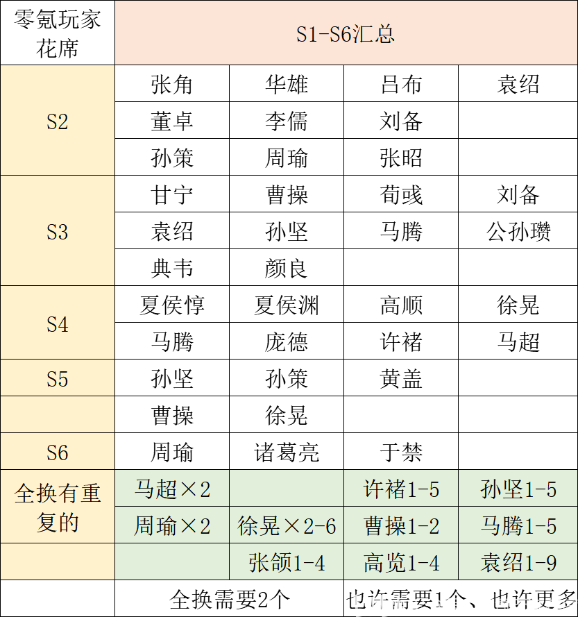

# 三国志战略版：1到6的赛季事件战法大全

## 一：S2赛季事件战法



S2赛季需要五星武将：

张角、华雄、吕布、袁绍、董卓、李儒、刘备、孙策、周瑜、张昭。

S2赛季需要四星武将：

李傕、郭氾、糜竺、孔融、张宝、张梁。

“有的大佬没存孔融、糜竺，导致无法兑换抚辑军民”

潘凤、陶谦虽然是蓝卡，也要先存一张，免得开荒时你抽不到，没法用新战法。

S2赛季比较强势的战法是太平道法、鬼神霆威、抚辑军民、火炽原燎。

太平道法自从2赛季出现，一直是法师的心头肉，恨不得每个法师都能带一个太平道法，所以1赛季玩家千万别闲着没事拆张角，那可就亏大了！

鬼神霆威：有鬼神的吕布和没鬼神的吕布是两个武将，秒主将时就靠这个战法。



火炽原燎：适合文武双全的武将用，赵云可以用它打藤甲兵。

抚辑军民：曾经的2赛季没人用，但随着3赛季后爆发流崛起，这个战法用的人变得很多。



气凌三军：适合特定武将的战法，输出稳定。

虎踞鹰扬：马超、太史慈、孙尚香都可以用，但需要3个武将，平民一般换不起。

焚辎营垒：性价比很低的战法，伤害能力很低，禁疗实际上用处也小。

“不建议换焚辎营垒这个战法，真没多大意义，3-6赛季没人用，因为带了也没什么用”

## 二：S3赛季事件战法



S3赛季需要的五星武将：

颜良、典韦、荀彧、甘宁，袁绍/孙坚/马腾/公孙瓒/曹操/刘备6人中选四个，也可以4马腾或2马腾+2袁绍。

S3赛季需要的四星武将：

皇甫嵩、朱儁、卢植、张绣、胡车儿，朱儁、卢植获取有点难度，皇甫嵩、张绣、胡车儿比较容易。

三星蓝卡需要何进、宋宪，还要一张二星绿卡曹昂。



整装待发是平民玩家必须换的战法，提前准备好这四张卡，治疗效果非常稳定！

锦帆军、青州兵、虎卫军建议根据自己情况换，这三个兵种使用情况并不如无当飞军、白马义从、虎豹骑高。

锦帆军适合太史慈、孙权队伍，没这两个武将换了用处也不大。

青州兵适合马超、关羽、张飞等具有稳定群攻的武将，能更稳定的触发青州兵特效。

虎卫军目前队伍非常少，谨慎兑换！



当锋摧决是强势战法，给太史慈或孙权带上就是各种被动、指挥队伍的克星，建议一定留着颜良兑换这个战法。

“当锋摧决的伪报状态甚至可以让洞察失效，不过伪报可以被刮骨疗毒净化”

三势阵需要6个君主型武将，幸好开局送袁绍、6元送孙坚，只要再抽2个任意武将就能兑换，建议用马腾、袁绍、孙坚兑换，公孙瓒、曹操、刘备搭配队伍还是很好用的。

## 三：S4赛季事件战法



S4赛季需要的五星武将：

夏侯惇、夏侯渊、高顺、徐晃、文丑、马腾、庞德、许褚、马超×2。

马超太忙了！

S4赛季需要的四星武将：

李傕、郭氾、李典、韩遂。

还需要三星吕虔，想在第四赛季第一时间换刚勇无前一定要提前准备李典和吕虔。刚勇无前、裸衣血战是比较实用的战法，铁骑驱驰看队伍需要。

引弦力战目前是最垃圾的事件战法，没必要换，输出能力甚至比不上手起刀落来的痛快，谁换谁后悔！

知道为什么谁换谁后悔吗？

## 四：S5和S6赛季事件战法



S5和S6赛季一共3个事件战法，但是非常实用，不过兑换难度也是相当的高。

需要的五星武将：

孙坚、孙策、黄盖、曹操、徐晃、周瑜、诸葛亮、于禁。

袁绍/曹操/高览/张颌/徐晃/许褚，选四个不需要的就行，也可以四个同样的武将。

需要的四星武将：

韩当、刘表、审配、陈琳、曹洪。

独行赴斗相对容易，适合程普和夏侯惇这样的武将携带，周瑜也可以携带，毕竟瞬发还能增加40%统帅。

至于婴城自守和草船借箭能换就换，特定场合用处很好。

## 五：总体评价



哪些优先兑换，哪些不适合兑换看这个表就可以，太平道法、三势阵、当锋摧决、裸衣血战已经是目前队伍的标准配置，其他战法都是根据不同队伍需要再换。

别浪费武将换焚辎营垒和引弦力战。

**【最后总结：所需武将总表】**



按照每个赛季汇总了一遍，下面是需要2个武将的，曹操、袁绍、孙坚、马腾因为三势阵的存在，也许一个就够、也许需要5个。

```admonish
[三国志战略版：1到6的赛季事件战法大全，这些武将你需要留着用 By 零氪玩家花席](https://www.bilibili.com/opus/468540215711327003)
```
