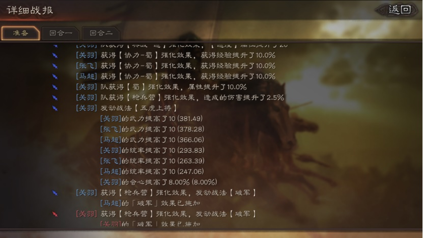
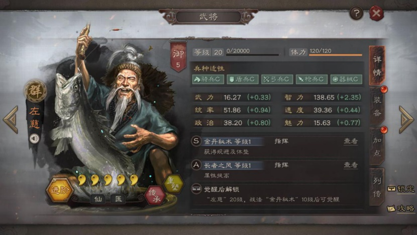
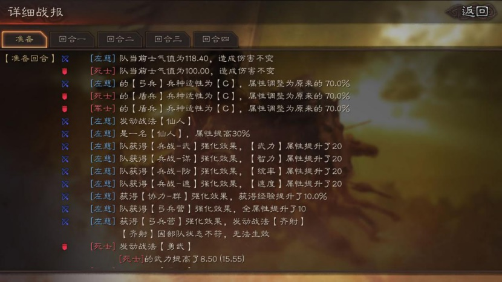
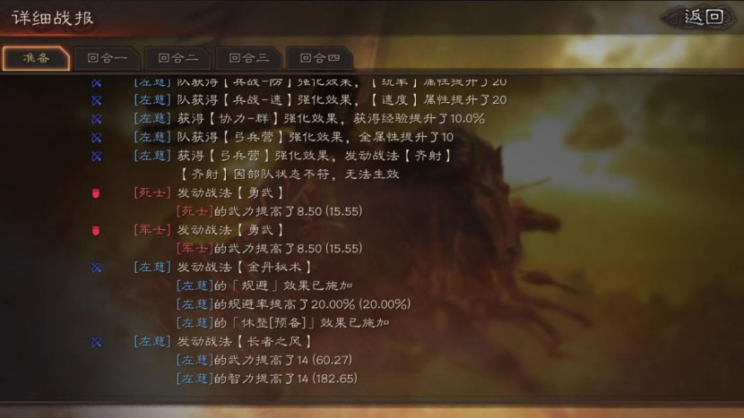

# 战报解析

武将属性的因素：

1. 武将面板属性：1级属性、每级成长属性、属性加点
2. 装备属性：所有装备属性加成，包括武器、防具、坐骑、宝物
3. 兵种适性：武将资料面板中骑兵S、盾兵A...，兵种适性S属性*120%，A*100%，B*85%，C*70%

4. 仙人战法：武将资料面板中左下方仙人标签，目前具备仙人战法只有3位——左慈、于吉、华佗，仙人战法属性+30%

5. 军事建筑：兵战-武/谋/防/速，升满级全队全属性+20点

6. 军事建筑：协力-魏/蜀/吴/群，升满级全队全属性+10%

7. 军事建筑：弓兵营全队全属性+10点，骑兵营全队首回合速度+20

8. 各种缘分效果：例如五虎上将全队武力、统率+10点，西蜀之智智力+14点等等

9. 各种加属性战法：例如长者之风满级全队武力、智力加28点等等

这九项属性加成决定了武将在战斗中最终的属性计算结果，那他们计算的先后顺序是怎样的？实测之后结论如下：

Step1：计算武将基础属性=武将面板属性（包括1级属性、成长属性、属性加点）+装备属性，例：我的50级关羽，加点武力37、速度13，0进阶，加上装备，基础武力266.28

Step2：计算兵种适性、仙人属性=武将基础属性*（兵种适性属性百分比+仙人属性百分比），例：还是那个关羽，枪兵*120%，无仙人加成，武力266.28*120%=319.54

Step3：计算军事建筑 协力-魏/蜀/吴/群国家加成=兵种适性、仙人属性*（1+国家加成），例：还是我的五虎枪关羽，武力319.54*110%=351.49

Step4：把剩下的所有加的属性全都累加上去，兵营，兵战+20武力，五虎+10武力，最终武力351.49+20+10=381.49



所以最终的属性计算公式=武将基础属性（包括1级属性、成长属性、属性加点、装备属性）*（兵种适性属性百分比120%/100%/85%/70%+仙人属性百分比30%）*（1+协力国家加成10%）+兵战20点+弓兵营10点+缘分属性+战法属性。

经过很多队伍的测试，可以保证公式是没问题的，大家可以自己测试，方法很简单队伍里随便一个人学个长者之风，准备回合括号里的就可以看到最终属性。

下面针对属性公式给大家一些小提示：

1.基础属性，也就是咱们可以在自己队伍里看到的面板属性，是效果最强的。基础属性在战斗中是做乘法运算，最高加成可以达到132%（S兵种适性120%*国家加成110%=132%）,而战法和缘分的属性加成效果更多是做加法运算，属性加成效果只有100%。

2.那么仙人的30%呢？大家可以看看那三位神仙的兵种适性，于吉是唯一兵种适性有一个B的，C兵种适性70%+仙人30%=100%（和A兵种适性一样），B兵种适性85%+仙人30%=115%（弱于S兵种适性），再看看三位仙人的面板属性，真的是身板很弱。







战报解析：左慈基础属性武力16.27*（弓兵兵种适性属性百分比70%+仙人属性百分比30%）*（1+协力国家加成0%）+兵战-武20点+弓兵营10点+缘分属性0+战法属性长者之风武力14=60.27。

3.国家队S兵种适性属性加成最高132%，国家队A兵种适性110%，混编队S兵种适性120%，只看单一武将来说，S兵种适性属性强于国家队A兵种适性，但是国家队是全体武将加10%属性，大家可以斟酌选择。

``` admonish title='出处'
[【战斗机制】武将属性计算公式详解](https://sgz.ejoy.com/jinjie/detail-5268.html)
```

