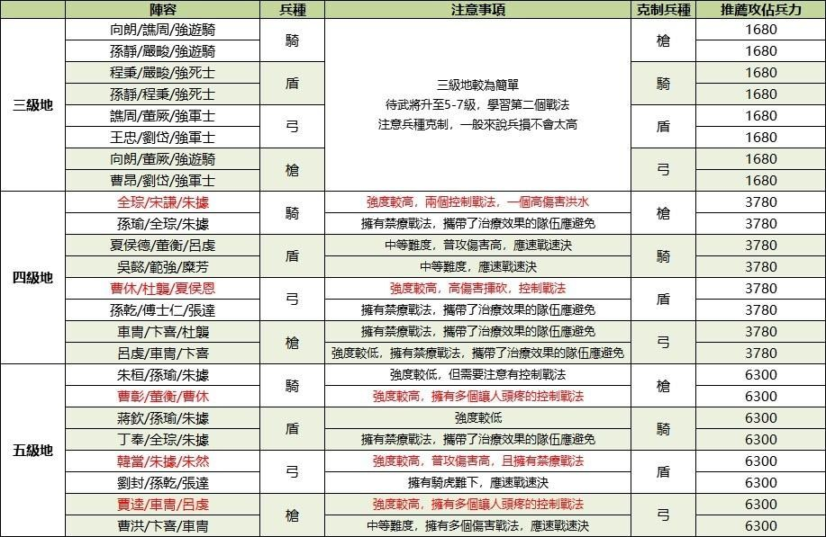
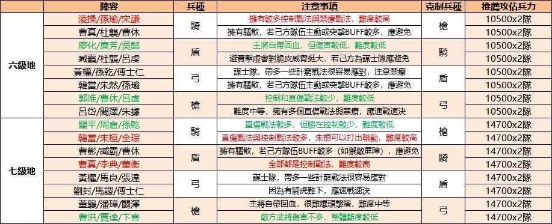

# 资源地攻略指南

## 资源级地的差异





## 攻占六、七级地的Q&A

### 武将大概要练到什么程度适合攻占六七级地？
正常的情况下，会建议将队伍中的武将都练至30级后才尝试，
若是「兵营」的等级升的比较高的话，可以在28级左右的时候去尝试做攻占。
因为从六级地开始有两队敌方队伍，因此建议多准备一队的队伍在旁边负责补刀。
七级地同理，大多数情况下需要35级以上才能攻占，且要准备好两队。
(如果真的不知道如何判断，可以直接看自己一队的兵力是多少，但武将等级跟战法还是有很直接的影响的，所以不是兵营等级拉高兵量够就直接冲，可能会损失惨重。)

### 六级地以上，侦察不到第二队，怎么办？
由于六级地以上是由两队的敌人驻守，而第二队是无法被侦查到的!
因此只能根据第一队的兵种与配置进行抉择，选择难度最低的第一队，不管第二队的配置如何，都可以把战损降至最低。
另外己方部队也可以有两个兵种互补，如第一队骑兵，第二队为弓兵，都可以防范敌方第二队无法侦察所带来的风险。
或是在第一战的打赢第二队战平的情况下，透过战报去了解第二队的情况。
还有一个比较特殊的作法，通常是建议在打八级地在这么做，就是在资源地旁建造一个营仗，也可以在了解过战报后来解决这个问题。

### 六级地以上的资源产量提升不高，我为什么要消耗这么大兵力去攻占呢？
六级地以上都可以筑城，建造特殊建筑，如造币厰提升铜币产量，或是将其作为中心来建造分城。
这些特殊建筑的价值是不能单纯拿资源产量来衡量的，当然，是否要消耗这么大兵力去攻占还是要根据发展情况判断，不过就算是当作单纯堆进主线也是有必要的。

### 稳定开七级地
- 1、军营等级一定要跟上，开七的话军营等级不需要太高，7-9级即可。
> 军营等级的提升，能够大幅提高武将的带兵上限，7-9级的军营等级，能够单个武将提高1400-1800的兵力，武将满的话可以提高4200-5400兵力，这是开七的首要条件。
- 2、三个武将的话武将等级需要满35级，两个武将的话武将等级需要满38级左右。
> 能开七级地的话，统御值一般都能满足上阵三个武将的条件了，三个武将开七级地的话，如果不是特别强势阵容，一般来说三个武将需要满35级左右，军营等级最低7级起步，如果有刘备或者张飞或者是刘备或者赵云，带额外的一个工具人，35级5级军营就可以开了。

> 两个武将的话对于武将的红度和等级要求就很苛刻了，兵力上的优势，武力或者是智力等属性上的优势以及战法的搭配，都是决定能够成功开七的因素，军营等级越高越好，武将等级建议在双武将38级左右，即便是刘备和张飞这样的强势队伍双开七级地，也需要考虑战损的问题。

- 3、武将战法的搭配，原则就是有什么战法就用什么战法，什么战法适配就用什么战法。

```admonish info title="出处"
- [【心得】六七級資源地攻略指南!](https://forum.gamer.com.tw/C.php?bsn=36815&snA=786)
- [三国志战略版：如何稳定开七级地？](https://game.xiaomi.com/viewpoint/1401771559_1644485507256_13)
```