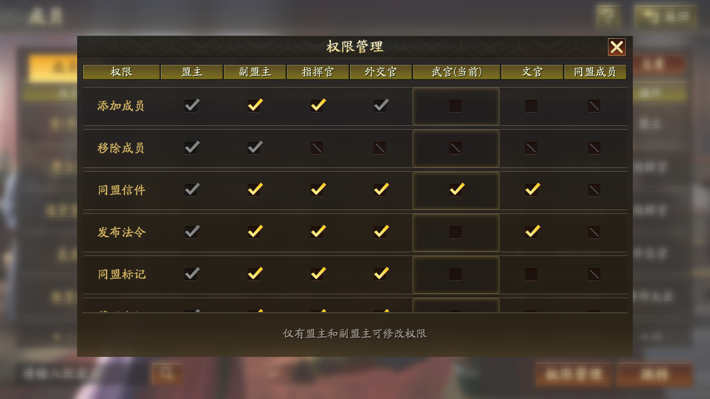

# 法令汇整

S1 同盟职位分配如下

 

法令：只有同盟的盟主、副盟主、指挥官可以编辑法令，最多可以同时发布10个法令

```admonish
另外在同盟当中也还可以通过发同盟邮件联系和告知同盟成员，同样同盟邮件也是有限制的。
```

同盟邮件：同盟的盟主、副盟主、指挥官、外交官和官员可以发送全盟邮件

分组邮件：只有分组的管理者可以发送当前分组成员可见的分组信件，其他分组的成员是无法看到的，同样盟主也是无法看到分组当中的邮件，这个也是分组当中的一个重要功能!

信件内容颜色标注

- 蓝：@文本@
- 绿：$文本$
- 红：&文本&
- 黄：#文本#
