# 一、前言
游戏的核心玩法在于后期的PVP，同盟，配将等玩法，良好的开荒，能帮助主公有一个良好的资源基底，方便快人一步。当新手玩家进入游戏时，做完新手任务后可能就不知所措了。在这里给大家明确我们游戏前期目的，就是保证自己的队伍能低损攻占五级地，尽快提升君王殿至7级（简称七本），然后有资格建造军营（单武将可携带更多兵力），我们的开荒就结束了。在未能开5以及七本之前，是新手最难度过的时期，在这里教大家在新手保护期48小时内如何快速完成开荒目标。

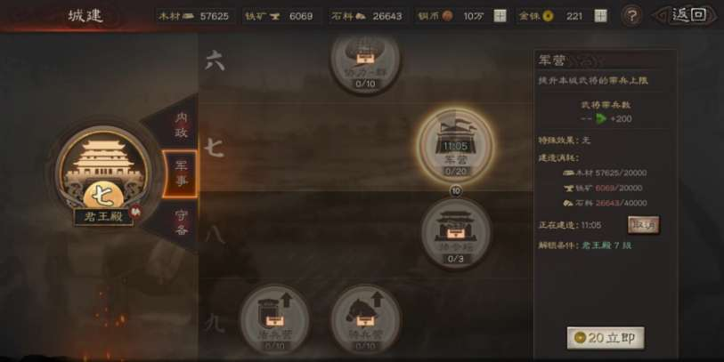

# 二、开荒准备
想要加快开荒节奏、平稳过渡到七本，我们需要做以下准备：
1. 存一些玉璧或金铢，用于加速建筑升级和抽取开荒武将。
2. 大约两天的充足业余时间：因为在前两天拥有新手保护，会为开荒提供便利。

PS：提升名声到一定的节点会开放以下两种事件，合理使用可以加速开荒进程。
- 【屯田】（名声到3500开放）消耗3策书来获取资源。建议屯4级地或5级地，3级地以下屯田获得的资源偏少。
- 【木牛流马】（名声到4000开放）击败后可获得资源与预备兵数量，每天早上8点，下午2点，晚上8点刷新。


# 三、开荒思路

在教学阶段，主公将获得**关平**、**曹休**和**孙乾**三位武将，合理使用可显著提升开荒效率。  

关平：属性全面，骑兵、盾兵、枪兵适性均为A级，非常适合开荒。被动战法“奋突”有概率提升攻击并对敌军造成高额伤害，是前期攻占高级地块的优先选择。

曹休：武力属性较高，适合作为战法传承武将。传承战法“挥砍”满级后对单体造成125%兵刃伤害。

孙乾：辅助型武将，提供增益效果，适合作为初期的辅助角色。

## 占地思路
1. 打空地、一级地和二级地随便上队伍基本无伤，但也别过多打低级地，武将5级左右开三级地，合理运用体力（武将自带120体力，新手期出征一次扣8点，非新手期15点）。

   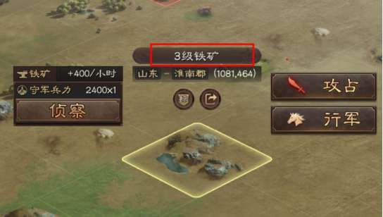

2. 勤用侦查（推荐3级地开始侦查），探兵力兵种，根据骑→盾→弓→枪→骑的克制顺序合理调整兵种。

3. 部队每出征一段距离，就会失去部分士气，士气决定了战斗时造成的伤害，队伍停留休息会逐渐恢复士气，回主城或者调动进己方营帐会回满士气，所以尽量不要攻占太远距离的野地，若迫不得已，先行军至地皮上，待体力恢复再战。

   ```admonish warning title="注意"
   每行军1格就会消耗一点士气，不满100的情况下战斗会降低造成的伤害
   ```

4. 若领地已满或暂时无地可打（没有低级野地或打不赢高级地），可先放弃低级地，或者反复扫荡低级地提升武将经验，合理运用体力。

5. 普通阵容注意兵种克制，尽可能多兵力去开，降低损失，5级地9000兵力，强力阵容推荐5000兵力开，普通阵容6000兵力，再带一队3000兵力补刀以防万一；占地翻车在前期太伤，新手期虽然60％资源返还，但你比别人又慢了一步。

   4级地守军5400

   

   5级地守军9000

   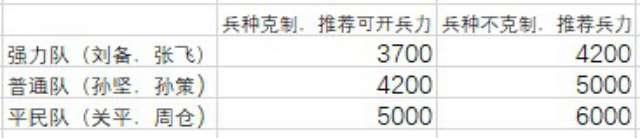

   若获得强力的开荒将代替孙坚孙策，如夏侯惇，乐进，太史慈等，自带战法稳定且可一开场便能触发的，可降低一部分兵力开四级地或无级地。

   ```admonish title="补刀技巧"
   当你的队伍出征一块资源地时，可能会有战败的可能，当失败时候，主公的队伍会返回主城，而敌方的队伍则需要3分钟恢复至正常状态，补刀则意味着需要3分钟内再次派一个队伍出战。
   ```

   ``` admonish title="伤兵"
   每场战斗都会产生伤兵，若继续下场战斗，伤兵不会上阵，因次建议每次战斗後即时回城恢复
   ```

   

## 城建升级思路
开荒期领地少，资源有限，为了尽快七本，一切跟着任务走（只做主线任务，副线加同盟也可提高资源产量，其余副线不做）。差什么资源就多占领对应资源产量的土地，其中石料只会用于升级建筑，粮食只会用于征兵。不断扫荡低级地，提升武将等级，高级将领能带更多的兵，不让体力浪费，根据任务主线走，第一天结束（开荒12小时算）时君王殿能升至6级，开5级地（优先石头地）；7级需要28w8的石料，需将仓库升级至9级（30w容量），期间不断开5级地、屯田高级石头地，新手期结束前一定能开军营。

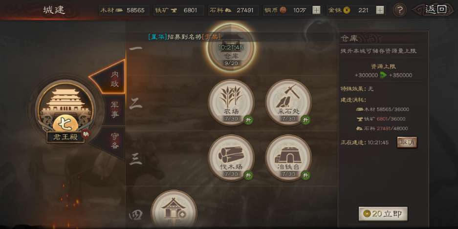

```admonish warning title="注意事项"
1.切记不要胡乱升级建筑，只跟任务里面的主线走；附上开启七本之前各大建筑升级表。

内政：仓库9级农场/采石场/伐木场/冶铁台7级民居7级。

军事：军舍3级征兵处3级武/谋/防/速3级点将台1级。

2、除主力队以外，可养一至两队战斗力稍弱的副队，用于铺路、屯田或拦截木牛流马；主力队不要浪费体力来做这些事情。
```

# 四、资源用完了如何获取
## 1.屯田
选择相应的资源地，随便派遣一支闲置的队伍，消耗三本策书进行屯田。屯田一次消耗10分钟，10分钟后可以获得与该资源地类型相同的资源，即石料资源地屯田只会产出石料，而非其他资源。资源地等级越高，屯田所获得的资源越多。

## 2.等待
依据资源产量，每小时会产出相应的资源。只需要耐心等待一段时间，就能获得资源，然后利用资源发展兵力。

## 3. 木牛流马
木牛流马于每天8点、14点、20点刷新，战胜能获得一定的资源和预备兵。如果资源缺少，切记别忘了去拦截木牛流马。

## 4.讨伐贼寇
霸业到达一定阶段后，地图上面会刷新出来部分贼寇，消耗一本策书可以对他们进行讨伐。5级贼寇战胜可以获得10000资源，但是类型随机。故而这种获取方式不是很值得提倡，毕竟不一定会获得需要的资源。

## 5.贸易
如果是缺少单一资源，其他资源充足的情况下，那么能在君王殿升至5级时，解锁集市。然后点击政厅，再点击贸易。然后就可以依据一定比例，将相应的资源进行转换，以获取所需的资源进行利用。

## 试炼
每天晚上0点会刷新试炼，试炼会随机给到一些资源，难度越高给的资源越多。

# 五、新手开荒战法推荐

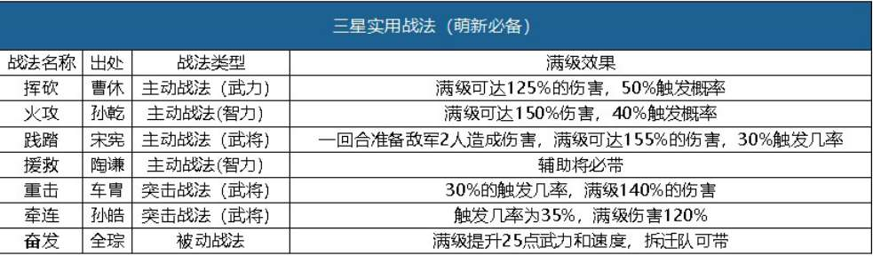


# 六、开荒武将推荐
## 孙坚：★★★★☆

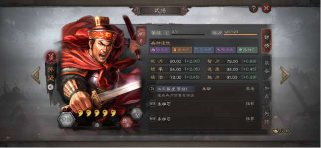

评价：

1，属性基础高，成长也不低（从五级地开始，谋略输出见长的野地武将逐渐变多，一些高武力低智商的武将，如吕布张飞之流，相对统率、智力均衡发展的孙坚，简直是脆皮鸡）

2，兵种适应性优秀多变；

3，战法瞬发，基础50%战法发动概率，群体伤害，嘲讽锦上添花；

综述：平民开荒的最佳选择。

## 张飞：★★★★★

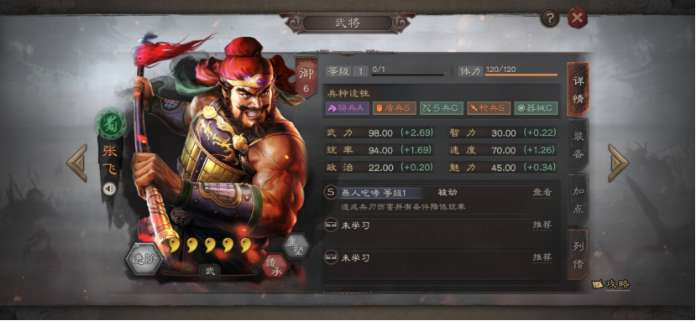

评价：

1.速度属性优秀，高于大多输出武将，弱智；

2.兵种适应性高；

3.被动战法输出稳定，全体伤害，附加的破防效果前期不明显（此时很多武将防御都不高），后期的破防潜力可圈可点。张飞前四回合中，每两回合必定造成一次全体伤害，在关键回合拥有更稳定的伤害，但是要注意一点：关平的自带战法“奋突”持续时长为一回合，而高速的张飞指挥战法释放，是快于关平的奋突以及大多武将带的落凤，它们持续时间都低于两回合，不足以形成张飞破防的前提；后期关羽、张飞的配合可以完美兼容二者的战法，“盛气凌敌”战法几乎与张飞是绑定使用的。

4.五虎的缘分以及强度都挺高，预计桃园组合将是蜀国最强力的国家队。

综述：开荒稳定，后期转型纵享丝滑，6御相比7御更加适合作为开荒武将。除了弱智，算得上完美的武将，即便到后期，能和大哥、二哥组成桃园组合，依旧是爸爸级别的优先度。

## 刘备：★★★★★

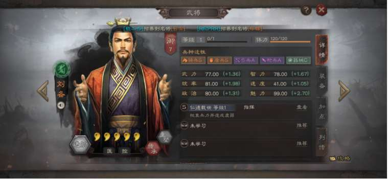

评价：

1.完美的兵种适应性，优秀的三维，速度略低，不适合做先手控制，更适合后手辅助。

2.核心战法“仁德载世”，是跨级打地的根本——刘备虚弱和治疗本身就非常不错，百分百的发动概率更是完美，符合开荒求稳的核心诉求。

综述：开荒最强辅助，没有之一。尤其在攻打6级以上土地时作用更加明显，后期也可组成桃园、奶枪等强势阵容，有的话一定要练起来。

## 法正：★★★★★

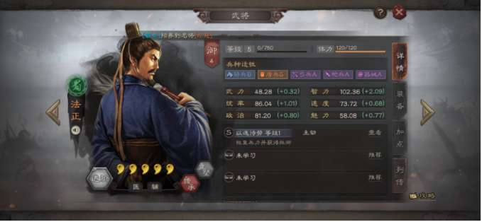

评价：

1.兵种适应性在初期可以说是百搭，甚至在攻城队没有出来的时候，法正顶上也可以。

2.奶量高，高速的免伤buff强，35%的看脸几率不及刘备稳定。

注意：很多的新人玩家在选择奶妈或者回血战法时（对，点名你——A级战法自愈），容易忽视武将的基础速度和战法类型，战法类型会决定释放顺序:被动＞指挥＞主动＞普攻＞突击。低速肉盾，例如孙坚、曹仁携带自愈可抗伤然后回血，但是像夏侯惇，70+的速度，携带回血战法就尴尬了。

综述：性价比极高的选择，前期开荒小助手。

## 李典：★★★☆

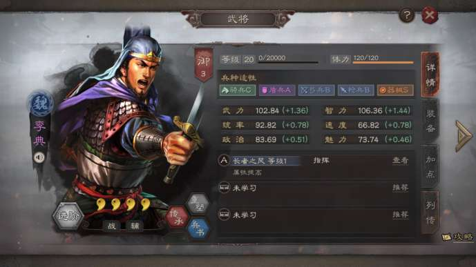

评价:

1.前期开荒最强指挥战法，直接提升全队三个人的14-28武力，智力值，也就是说每个武将的普攻，技能带来的伤害会有至少10%以上的提升。

2.需要注意的是，指挥战法在武将溃灭后将无法提供增益效果，所以改版之前给李典分配1个兵就行的打法现在实用度变低了，建议多带几个兵，增加生存能力。

综述：3统御值的武将，全队增益效果，能帮助开荒队带来质的提升。

# 七、开荒阵容推荐

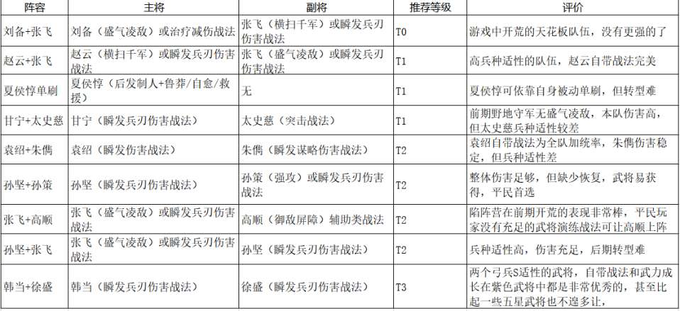

### （1）固定伤害+奶型开荒

为什么会说固定伤害呢？因为主动战法几率问题，比如吕布开荒，吕布不放战法，那就战损高的很，如果放战法了二回合解决战斗。所以这个时候固定伤害战法可以把开荒稳定性大大提高比如说，张飞燕人咆哮就是很好的例子。


### （2）兵刃伤害+奶型

开荒的核心就是兵刃伤害、普攻伤害。因为每个将都会进行普攻，而且野地的将基本没有缴械战法（二赛季不知道有无改变），所以侧重于兵刃伤害的将开荒是十分好的选择，比如太史慈、马超。


### （3）免控+奶型

赵云自身免控，可以用来做完美的输出将，无惧任何Debuff可以打出十足的输出。


### （4）新手平民型
适合所有新手的阵容，挥砍战法可在曹休传承出来。


# 八、其它事项
## 推荐大力培养的四星武将
- 弓兵：韩当、潘璋、蒋钦、徐盛、张任、朱儁
- 枪兵：张绣、皇甫嵩、张梁、丁奉
- 盾兵：郭淮、文聘、逢纪

## 签到获得武将解析
1. 庞德：主要是为了拆战法暂避其锋，庞德自身算一个三流武将，但是他的传承战法是妥妥的T1级别。
2. 李典：最佳工具人武将，3御武将中只有5星武将蔡文姬能跟他争一争开荒期工具人的位置了。
3. 纪灵：看情况拆战法或者当材料。
4. 甄姬：全游戏第二高魅力的武将，其本身的内政作用大于传承战法。
5. 袁绍：良心武将，群弓阵容的代表性武将，非常适合平民。袁绍+朱儁基本上就构成群弓体系了，平民玩家一定要练起来。