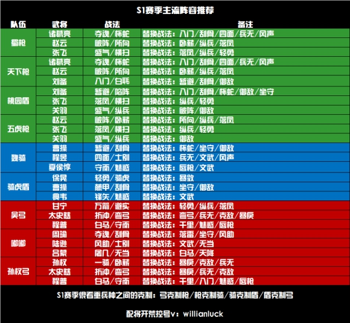

# 三国志战略版 S1 开局攻略

## 一、入门攻略

### 1. 主公选择
赛季开局提供4种主公类型：明主、贤主、英主、霸主。  
回答路线参考：  
- **明主**：11133  
- **贤主**：33333  
- **英主**：11111  
- **霸主**：11121  

#### 主公属性对比
| 类型   | 奖励道具       | 属性加成                     |
|--------|----------------|------------------------------|
| 明主   | 三文矛         | 武力 +4，统率 +6            |
| 贤主   | 50000铜币      | 速度 +6                     |
| 英主   | 1300战法点     | 智力 +6                     |
| 霸主   | 大宛马、服方尊 | 速度 +4，武力 +6            |

**推荐选择：** 贤主或英主  
- 贤主提供50000铜币，可换1000战法点及蓝将，甚至可能获得紫将。  
- 英主提供战法点，适合战法升级需求。

### 2. 开荒武将推荐
- **买开局号**：推荐赵云、张飞、刘备、夏侯惇。  
- **首充开局**：  
  - **68元**：孙坚 + 孙策  
  - **6元**：孙坚 + 关平  
- **0氪党**：关平 + 任意紫将/蓝将（开荒速度稍慢）。

### 3. 开荒节奏
1. 将战法点优先用于开荒武将，提升效率。
2. 武将到5级解锁第二战法，可先用B级战法过渡（需传承蓝将并演练）。
3. 武将5级、兵力1000后开始打3级地，优先升级武将和获取资源。
4. 武将10级后分配属性点，侦察周围4级地并准备开荒。
5. 开荒期间打木牛流马资源道具，并合理分配资源与兵力。
6. 武将20级后解锁第三战法与装备系统，准备开5级地。
7. 主城升7级君王殿，确保队伍能力过渡至高级土地。
8. 武将30级主力队伍即可开6级地，优先打资源地。

### 4. 前期发展

1. **跟随主线任务**
   - 开荒时期，建议各位主公可以紧跟主线任务。
   - 主线任务已经梳理了最合理的升级路线，一开始跟着主线升级设施，可以最大限度减少资源的浪费。
2. **加入同盟**
   - 加入同盟后会有同盟资源产量增益，对前期的发展会有较大帮助。
3. **委任内政官**
   - 随着任务的进行，委任功能会开放。
   - 有些武将自带内政战法，委任这些武将作为内政官时，可以有效提升城内各类资源的产量。
4. **名声、势力值**
   - 名声决定了可攻占土地的上限。
   - 名声每增加100点，领地上限可以增加1块。
   - 势力值是实力的象征，可以通过占领高级领地、建造个人建筑等方式提升。
5. **策书**
   - 策书可用于屯田、讨伐贼寇、建立营帐等，策书每小时回复一个。
   - 前期资源匮乏的情况下，不建议使用策书讨伐野怪，应尽量屯当前最高等级的资源田。

### 5. 资源获取

#### 一、资源是否可以进行买卖

在游戏中，四项基础资源（木材、石料、粮食、铁矿）无法通过金锥和玉璧进行购买。

玩家可以购买策书，策书具有多种功能，包括屯田、筑城、讨伐、营帐和箭塔。每个玩家每天最多可以购买三次策书。

#### 二、基础资源主要获取方式

1. **资源建筑**

   游戏中，主城和分城均拥有四个资源建筑，分别是农场、采石场、伐木场和冶铁台。每个资源建筑能够提升相应的资源产量。建议在前期资源充足的情况下，根据任务指引升级相应的资源建筑。

2. **资源地**

   资源地是游戏中获取资源的最基本手段，每占领一块资源地，都能根据其等级提升相应的资源产量。不同等级的资源地提供不同的产量，具体如下：

   | 资源地等级 | 木材 | 铁矿 | 石料 | 粮食 |
   | ---------- | ---- | ---- | ---- | ---- |
   | 1级        | 200  | 200  | 200  | 200  |
   | 2级        | 300  | 300  | 300  | 300  |
   | 3级        | 400  | 400  | 400  | 400  |
   | 4级        | 600  | 600  | 600  | 600  |
   | 5级        | 1300 | 1300 | 1300 | 1300 |
   | 6级        | 1500 | 1500 | 1500 | 1500 |
   | 7级        | 1700 | 1700 | 1700 | 1700 |
   | 8级        | 1900 | 1900 | 1900 | 1900 |
   | 9级        | 2100 | 2100 | 2100 | 2100 |
   | 10级       | 2300 | 2300 | 2300 | 2300 |

   从表格中可以看出，5级资源地的资源产量相比4级有显著提升。前四级的资源产量差距较小，而5级资源地则应尽量占领以提升资源产量。至于6至10级的资源地，尽管资源产量有所提升，但相对较为有限，建议根据实际需求进行攻占。

#### 三、资源是否可以进行抢夺

游戏中无法直接抢夺他人资源。如果你对其他玩家的资源地发起进攻并获胜，可以占领该资源地，从而增加自己的资源产量。如果对其他玩家的主城发起进攻并获胜，可以俘虏对方，但无法获取对方仓库中的资源。即使对方选择缴纳资源解除俘虏，资源也将由同盟获取，而非个人。

#### 四、资源用完了如何获取

1. **集市交易**

   如果缺少某一单一资源而其他资源充足，可以通过升级君王殿至5级解锁集市功能。在政厅点击贸易，可以依照一定比例将其他资源转化为所需的资源。

2. **屯田**

   选择合适的资源地，并派遣一支闲置队伍进行屯田。每次屯田消耗3本策书，时间为10分钟，可以获得与资源地类型相对应的资源。例如，石料资源地的屯田只会产出石料。资源地等级越高，屯田获得的资源越多。

3. **等待**

   根据资源产量，资源会自动产出。玩家可以等待自然产出。

4. **木牛流马**

   木牛流马每天在8点、14点和20点刷新，玩家可通过战胜木牛流马获得一定的资源和预备兵。如果资源不足，切记不要忘记去截击木牛流马。

5. **讨伐贼寇**

   在霸业达到一定阶段后，地图上会刷新一些贼寇，玩家可以消耗一本策书进行讨伐。战胜5级贼寇可以获得10000资源，但奖励资源的类型是随机的。

## 二、进阶攻略

1. **升级节奏：**  
   - 20~30级：扫荡5级地  
   - 30~40级：扫荡6级地  
   - 35~49级：扫荡7级地  
   - 40~49级：扫荡8级地  

2. **加入同盟：**  
   - 同盟玩法能增强互动性，包括打城、迁城、对抗等活动。

3. **俘虏解脱方式：**  
   - 缴纳资源  
   - 同盟解救  
   - 紧急撤离（放弃所有领地）

4. **前期资源管理：**  
   - 6级地建造币厂，升到2-3级即可。  
   - 每日铜币强征以加速战法升级。

5. **藏兵技巧：**  
   - 通过调整队伍位置藏兵
   > 假设您的主城有 5 个军舍位置，而您的主力队伍有 3 队。
   将这 3 队的主将分别移动到最后两个位置的副将位上，这样当敌人攻打您的主城时，主力队伍不会被直接攻击到。
   - 通过驻守终止藏兵
   > 在主城中，将部队设置为“驻守”状态，然后点击“终止驻守”。
   此时，队伍会停留在主城外表面上看仍在主城范围内，但实际上不会参与主城战斗，敌人也无法直接攻击到这些部队。

---

## 三、S1赛季主流阵容推荐

---

## 四、S1结束前需做的准备（备战S2）

1. **囤积资源：**  
   - 满红紫卡/蓝卡  
   - 3000金珠用于换战法点，1000金珠用于妙升建筑。  

2. **抽卡与改名：**  
   - 霸业割据包：8000金珠（20次抽奖，10次保底1橙）。  
   - 改名：500玉璧（赛季开始前3天可改名）。  

3. **赛季重置内容：**  
   - 玉璧、金珠、装备、材料、武将、战法保留。  
   - 其余内容（战法点、铜币、资源等）重置。  

4. **赛季环境变化：**  
   - S2由3~4个区合并，土地资源更加紧张。  
   - S1末期可多打野怪，准备装备。

5. **核心事项：**  
   - 转区：花费500金珠可在合并区间转区。  
   - S2限定武将：如孙尚香、司马懿、张辽，仅通过成就奖励或活动获取。  
   - 为S2兑换战法点准备足够武将。