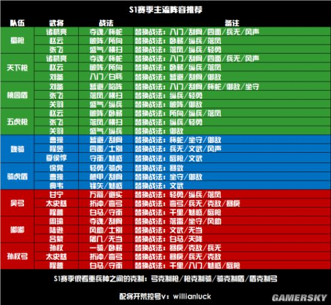

# 三国志战略版 S1 开局攻略

## 一、入门攻略

### 1. 主公选择
赛季开局提供4种主公类型：明主、贤主、英主、霸主。  
回答路线参考：  
- **明主**：11133  
- **贤主**：33333  
- **英主**：11111  
- **霸主**：11121  

#### 主公属性对比
| 类型   | 奖励道具       | 属性加成                     |
|--------|----------------|------------------------------|
| 明主   | 三文矛         | 武力 +4，统率 +6            |
| 贤主   | 50000铜币      | 速度 +6                     |
| 英主   | 1300战法点     | 智力 +6                     |
| 霸主   | 大宛马、服方尊 | 速度 +4，武力 +6            |

**推荐选择：** 贤主或英主  
- 贤主提供50000铜币，可换1000战法点及蓝将，甚至可能获得紫将。  
- 英主提供战法点，适合战法升级需求。

### 2. 开荒武将推荐
- **买开局号**：推荐赵云、张飞、刘备、夏侯惇。  
- **首充开局**：  
  - **68元**：孙坚 + 孙策  
  - **6元**：孙坚 + 关平  
- **0氪党**：关平 + 任意紫将/蓝将（开荒速度稍慢）。

### 3. 开荒节奏
1. 将战法点优先用于开荒武将，提升效率。
2. 武将到5级解锁第二战法，可先用B级战法过渡（需传承蓝将并演练）。
3. 武将5级、兵力1000后开始打3级地，优先升级武将和获取资源。
4. 武将10级后分配属性点，侦察周围4级地并准备开荒。
5. 开荒期间打木牛流马资源道具，并合理分配资源与兵力。
6. 武将20级后解锁第三战法与装备系统，准备开5级地。
7. 主城升7级君王殿，确保队伍能力过渡至高级土地。
8. 武将30级主力队伍即可开6级地，优先打资源地。

## 二、进阶攻略

1. **升级节奏：**  
   - 20~30级：扫荡5级地  
   - 30~40级：扫荡6级地  
   - 35~49级：扫荡7级地  
   - 40~49级：扫荡8级地  

2. **加入同盟：**  
   - 同盟玩法能增强互动性，包括打城、迁城、对抗等活动。

3. **俘虏解脱方式：**  
   - 缴纳资源  
   - 同盟解救  
   - 紧急撤离（放弃所有领地）

4. **前期资源管理：**  
   - 6级地建造币厂，升到2-3级即可。  
   - 每日铜币强征以加速战法升级。

5. **藏兵技巧：**  
   - 通过调整队伍位置藏兵
   > 假设您的主城有 5 个军舍位置，而您的主力队伍有 3 队。
   将这 3 队的主将分别移动到最后两个位置的副将位上，这样当敌人攻打您的主城时，主力队伍不会被直接攻击到。
   - 通过驻守终止藏兵
   > 在主城中，将部队设置为“驻守”状态，然后点击“终止驻守”。
   此时，队伍会停留在主城外表面上看仍在主城范围内，但实际上不会参与主城战斗，敌人也无法直接攻击到这些部队。

---

## 三、S1赛季主流阵容推荐

---

## 四、S1结束前需做的准备（备战S2）

1. **囤积资源：**  
   - 满红紫卡/蓝卡  
   - 3000金珠用于换战法点，1000金珠用于妙升建筑。  

2. **抽卡与改名：**  
   - 霸业割据包：8000金珠（20次抽奖，10次保底1橙）。  
   - 改名：500玉璧（赛季开始前3天可改名）。  

3. **赛季重置内容：**  
   - 玉璧、金珠、装备、材料、武将、战法保留。  
   - 其余内容（战法点、铜币、资源等）重置。  

4. **赛季环境变化：**  
   - S2由3~4个区合并，土地资源更加紧张。  
   - S1末期可多打野怪，准备装备。

5. **核心事项：**  
   - 转区：花费500金珠可在合并区间转区。  
   - S2限定武将：如孙尚香、司马懿、张辽，仅通过成就奖励或活动获取。  
   - 为S2兑换战法点准备足够武将。