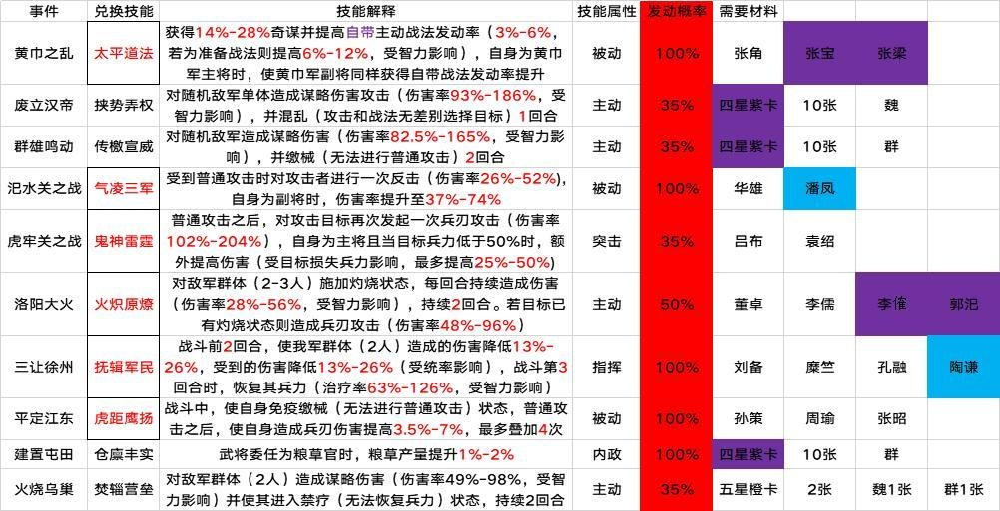
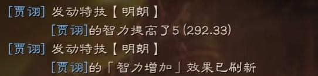

# 开荒前准备

## 1. S2开局保留内容详解
S2赛季更新后，保留以下内容：玉璧、金銖、装备、材料、武将卡、武将进阶数（就是满红武将的满红保留）、觉醒状态（就是这赛季什么武将是觉醒的，下赛季这武将还是一样的觉醒状态）、演练的战法、已传承战法和演练进度（就是拆解后没四星武将了，才演练到一半的）。其他全部清零。

## 2. 武将（战法点）储备
进阶满红的4星卡和3星卡屯满！（把换事件战法跟重要的4星3星武将需要提前锁定！避免误操作给转化掉了！）新赛季开始后金猪转化战法点，不管是平民还是土豪都推荐用金猪双倍转化！因为2000~3000金猪就算抽到好卡对开荒帮助也不大，但没有足够的战法点，开荒进度会落后很多，2个武将带4个10级战法和带4个5-7级战法的开荒速度是完全不一样的，下赛季人多地少，更加拥挤，开荒慢人一步很可能会被队友种地种死。
目前测试了一下，屯满3星，加一部分4星卡铜币转化的战法点大概在1w7-1w9左右，金珠转化的战法点大概在3w4-3w8左右。
一个5星10级战法所需战法点为9480，4个就是37920，金珠转换的战法点差不多刚刚好。
（紫卡记得多留点，后面开兵书用）
推荐锁定武将：李典，郭淮，张宝，朱儁（四星神将），张任（跟袁绍，朱儁搭配，平民群弓组合），以及各种内政武将，事件战法武将，还有部分器械S的紫卡。

## 3. 事件战法列表

## 4. 优秀的开荒技能
- S级：盛气凌敌，横扫千军，陷阵营，八门，杯蛇，瞋目横矛，破阵，夺魄，暂避，兵无常势
- A级：传檄宣威（新），御敌屏障，落凤，纵兵劫掠，坐守孤城，轻勇飞燕，暴敛四方

## 5. 装备，战马，宝物储备
好的装备附加属性相当于一次进阶，特殊的特技装备更可以提升武将战斗力上一个档次。新赛季装备（材料）完美保留，所以赛季后期就要开始做充分的准备，打野不能停。
（第一赛季一般情况下一个月就统一了，后期有大把时间可以打野弄装备材料，S2赛季后通常会打满一整个赛季，就没那么多时间让你好好刷野了，所以请珍惜第一赛季的打野时光！）
刷野推荐打8级以上的野怪，八级有50%几率爆紫色材料，九级野怪100%爆紫色材料，十级野怪100%爆紫色材料5%概率爆装备图纸。
每天记得训马跟寻访。
运气好一个赛季还是能出几个极品橙马跟宝物的。
这些土豪跟平民玩家都是一视同仁，只能靠每天的坚持累积起来。
S2武将20级之后立马可以换上装备，打五级地将会更稳健。
（注意一点，同一个装备特技在同一個武将身上只能生效一次，比如武器上有明朗特技，那么其他部位的装备上再上明朗特技就会失效！可以看下面图的战报截图）

