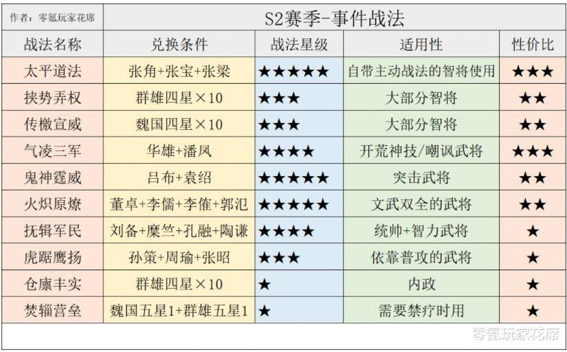

# 开荒前准备

## 1. S2 开局保留与重置内容详解

### 保留内容
- **玉璧、金銖数量**  
- **装备、材料**  
- **武将（包括进阶数和觉醒状态）**  
- **战法、战法演练进度**  

### 重置内容
- 名声  
- 资源  
- 铜币  
- 战法点  
- 城建设施等级  
- 同盟关系  
- 任务、试炼、成就  
- 首储奖励  

---

## 2. 武将与重塑说明

### 武将保留与重置规则
- **保留：**
  - 所有抽到的武将，包括其进阶数和觉醒状态。
- **重置：**
  - 武将等级、经验、配点、自带战法等级、已学习战法。

> **注意：** 新赛季需要重新培养武将，但进阶和觉醒状态保留。重塑可以恢复用于进阶的武将，尤其是 S2 赛季开始后部分战法需通过兑换获得的情况。  

### 重塑机制
- 重塑后的武将等级不变，但每次重塑有 **10 天冷却时间**。  
- 需提前重塑重要武将以便兑换战法。  

---

## 3. 战法点储备与使用

### 战法点储备技巧
- 进入 S2 赛季时，战法点将 **全部重置**，建议在赛季结束前开始囤积。  
- **建议：**
  - 不要急于转化武将以获取战法点。
  - 进阶三星武将（尽量变成三红勾玉）来节省武将栏位。

> **武将上限为 200 个**，多余的三星武将建议直接进阶。  

### 赛季前准备
- 提前 **1 个月** 开始囤积三星武将和铜币。  
- 赛季末尽量花光所有铜币，避免浪费。

---

## 4. 金銖储备与使用

### 储备建议
- S2 赛季开局有 **霸业卡包**：
  - 单次抽取消耗 **398 金銖**。
  - 可抽 **20 次**，每次必得良将或名将。
  - **满抽需 7960 金銖**（基本保底 2 橙将，提早抽到可收手）。

- 如果战法点不足，也可使用金銖转化战法点。  
- **月卡党建议：**
  - 在赛季种田期停止半价武将抽卡，积攒金銖。

---

## 5. 赛季奖励注意事项

赛季奖励的条件可以通过以下路径查看：  
主页面 → 更多 → 霸业 → 右下角【赛季说明】。  

### 基本条件
- 君王殿需升至 **10 等**。

---

## 6. 开荒重点内容整理

### 武将（战法点）储备
- **锁定换事件战法和重要武将**：避免误操作被转化。
- **金猪转化战法点推荐**：
  - 铜币转化：约 **1w7-1w9** 战法点。
  - 金猪转化：约 **3w4-3w8** 战法点（基本满足 4 个 5 星 10 级战法需求）。

### 推荐锁定武将
- 李典、郭淮、张宝、朱儁（四星神将）。
- 张任（与袁绍、朱儁搭配，适合平民群弓组合）。
- 各类内政武将、事件战法武将、器械 S 紫卡。

---

## 7. 装备、战马、宝物储备

### 装备准备
- **推荐打野：**
  - **8 级野怪：50% 爆紫色材料**。
  - **9 级野怪：100% 爆紫色材料**。
  - **10 级野怪：100% 爆紫色材料，5% 概率爆装备图纸**。
- **战马与宝物获取：**
  - 每天坚持训马和寻访，积累橙马和宝物。

> **注意：** 同一装备特技在同一武将身上只能生效一次。
  可以参考下述战报截图
  

---

## 8. 优秀的开荒技能
### S 级技能
盛气凌敌、横扫千军、陷阵营、八门、杯蛇、瞋目横矛、破阵、夺魄、暂避、兵无常势。

### A 级技能
传檄宣威（新）、御敌屏障、落凤、纵兵劫掠、坐守孤城、轻勇飞燕、暴敛四方。

## 9. 事件战法列表

