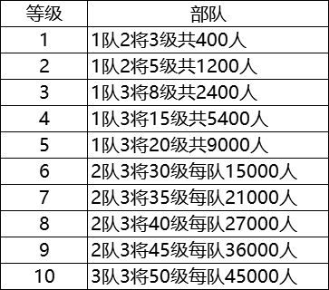
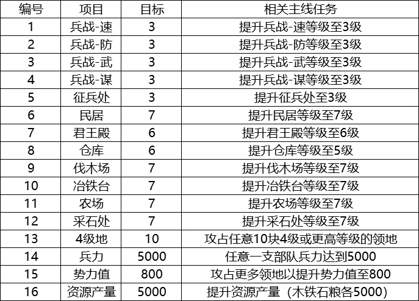
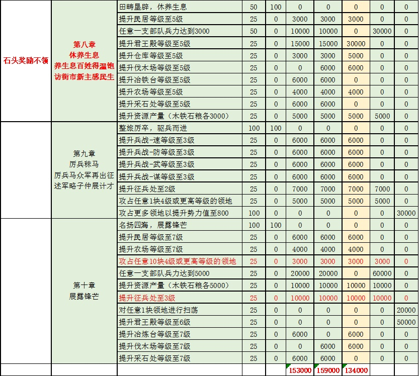

# 直上7本攻略

1.攻略目标

帮助玩家S2赛季实现40小时内升级7本，升级兵营，快速提升战力，达到尽早低损耗开5级地的目的。不管是零氪、微氪还是大氪、土豪，都可以尽快达到7本。

 

2.主要内容

本攻略结合本人S2开荒实战经历，通过主线任务资源爆仓，节约升级仓库的资源，从而达到快速升级7本的目的。

 

各等级野地兵力情况如下表：



要想快速升级7本，前期节约资源，非常重要，1兵=10木10铁20粮，翻车一次就会导致7本进度推后几小时。

 

本攻略以讨论快速7本为主，阵容为辅。

前期开荒阵容：桃园、夏侯惇、赵云、自己看着办，不是该攻略重点。

 

开荒严格控制战损，600兵2级地，1200兵3级地，尽量使用克制兵种，战损尽量控制在100兵以内，6本升级完之前，以3级地为主，战损低的话，是不太缺粮的，所以优先拿木石铁，严格按主线任务走。

 

每天的策书必买，1队4000兵左右稳开4级地，建议先开1块4级石，然后屯石头。打满3级地之后1队2队组队低损耗扫荡3级地，为低损耗打4级地做准备。

开荒第24小时之后，战力可以的，低损耗（损兵300以内）打满10块4级地。

 

以下为7本前需要达成的相关指标，编号不代表先后顺序，大家可以根据自己的实际情况灵活调整。



第八章到第九章的执行情况详见下表，奖励情况从左至右依次为名声、金铢、木材、铁矿、石料、粮食、铜币。



7本所需石头情况见下表：


按部就班完成第八章、第九章、第十章的主线任务。但是需要注意卡在6本和6级仓库囤满石头。

具体操作是，保持6级仓库，一直囤石头，囤到仓库满。第八章开始，石头奖励不领，一共可以领取134000石头，可以满足升级7本石头需求，可以节约两级仓库所需资源。

为了防止手残党误点任务，第3天的试炼任务先不要做，可以补充一点资源。这里所说的“第3天”是指登陆账号登陆服务器第38小时左右。例如本次第一批S2开服是2019年12月5日上午10点，准点进服务器开荒，这里第三天就是指2019年12月7日凌晨0点之后。

 

3.改进方向

土豪可以使用类似思路，尽早打下1块5级或者6级石头后，屯地，可以远低于40小时达到7本。关于阵容搭配，请参考智囊团推出的其它攻略。

``` admonish title='出处'
[【开荒攻略】s2赛季40小时7本攻略](https://sgz.ejoy.com/second/detail-5288.html)
```