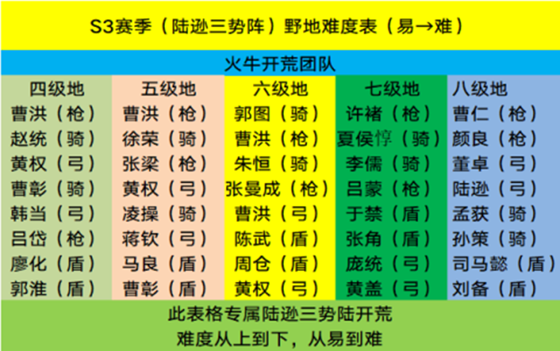
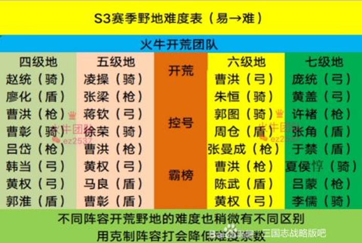

# 野地难度

1~3级地没什么难度，4级地开始要稳扎稳打3级地开始就要侦查，尽量选克制的队伍或难度低的打，开荒就是要求稳，稳就是快！ 4级地白板12级开，满红10级开。（12御双将队伍最好带上2御白卡工具人，双将15级后可以扔掉工具人） 5级地白板20级开，满红也是推荐20级开。（白板13御双将队伍最好带上2御白卡工具人） 6级地白板30级工具人20级以上，5兵营开（32级开更稳妥），满红30级+工具人20级3兵营开比较稳（工具人可以先扔到练兵场练2次就到20级了） 7级地白板39级10兵营开，满红37级8兵营开。

